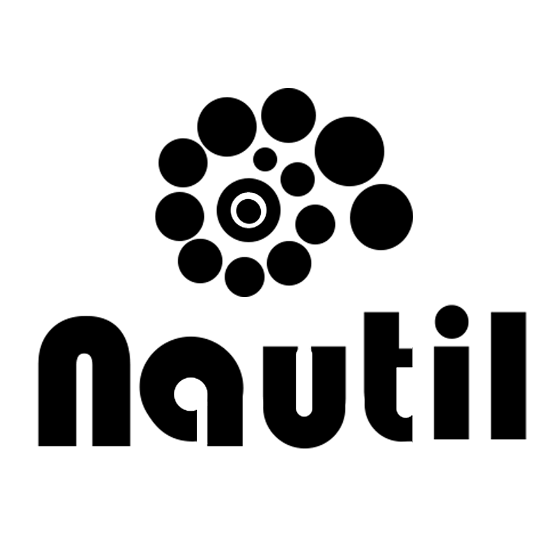

<div  align="center"></div>

<div  align="center">Nautil is a responsive, efficient, and flexible JavaScript framework for building cross-platform applications.</div>

## Introduction

Nautil is built on React and is a framework, not a UI library. Developers can use React components in Nautil applications directly as possible. *Nautil is absolutely React, however, Nautil is more than React.* As a framework, it provides router/navigation, state management, data management, event stream, internationalization and ability of cross-platform.

The purpose of Nautil is to make development more easy, quick and comfortable.

Without importing all the ecosystem of React, without complex redux, without any more choice of third part libraries, you will begin and build your application quickly with Nautil. Feel happy and relaxing when you writing with Nautil. It will work as what you think. You do not need to learn more than react. The only thing you need to know is some feature level api. There is no syntax level or higher knowledge to learn.

To have a taste quickly, run with:

```
mkdir my-app && cd my-app
npx nautil-cli init
npm run dev
```

## Documentation

⚠️ In development, welcome to contribute!

【[中文文档](https://www.tangshuang.net/7273.html)】

- Concepts
- Guide
- CLI
- Component
  - props
  - stylesheet
  - two-way-binding
  - event-stream
  - lifecycle
- PropsType
- Builtin-Components
- Store/State
- Depository
- Navigation
- Stream
- Operators
- Style/CSS
- Model
- Animation
- Internationalization
- Cross-platform
- Contribute Guide
- Thanks

## MIT License

Copyright 2019 tangshuang

Permission is hereby granted, free of charge, to any person obtaining a copy of this software and associated documentation files (the "Software"), to deal in the Software without restriction, including without limitation the rights to use, copy, modify, merge, publish, distribute, sublicense, and/or sell copies of the Software, and to permit persons to whom the Software is furnished to do so, subject to the following conditions:

The above copyright notice and this permission notice shall be included in all copies or substantial portions of the Software.

THE SOFTWARE IS PROVIDED "AS IS", WITHOUT WARRANTY OF ANY KIND, EXPRESS OR IMPLIED, INCLUDING BUT NOT LIMITED TO THE WARRANTIES OF MERCHANTABILITY, FITNESS FOR A PARTICULAR PURPOSE AND NONINFRINGEMENT. IN NO EVENT SHALL THE AUTHORS OR COPYRIGHT HOLDERS BE LIABLE FOR ANY CLAIM, DAMAGES OR OTHER LIABILITY, WHETHER IN AN ACTION OF CONTRACT, TORT OR OTHERWISE, ARISING FROM, OUT OF OR IN CONNECTION WITH THE SOFTWARE OR THE USE OR OTHER DEALINGS IN THE SOFTWARE.
