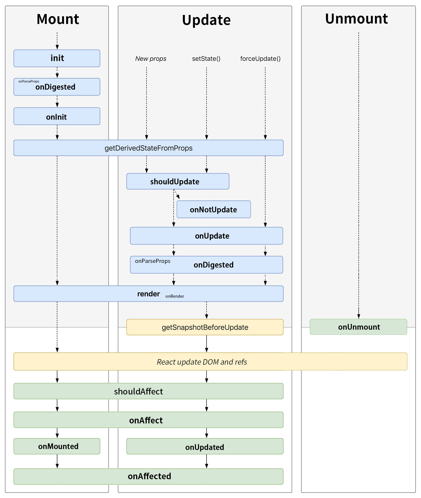

# Lifecircle

A little different from react, Nautil has its own lifecircle:

- init: when `constructor` run, should always be override insteadof using `constructor` with `super`
- onDigested: after this.attrs, this.className, this.style... generated
- onInit: after this.$state generated
- onMounted
- onAffected: will be invoked after mounted/updated, like useEffect do
- =============
- shouldUpdate
- onNotUpdate
- onUpdate
- onDigested
- onUpdated
- onAffected
- =============
- onUnmount
- =============
- onCatch

Nautil lifecircle functions should not use together with react component life circle functions (except getDerivedStateFromProps and getSnapshotBeforeUpdate).

For Nautil components, they will run a `digest` task to generate derived properties such as `attrs` `style` `className` and so on. After this task, before `render`, a `onDigested` lifecircle function will be called.
