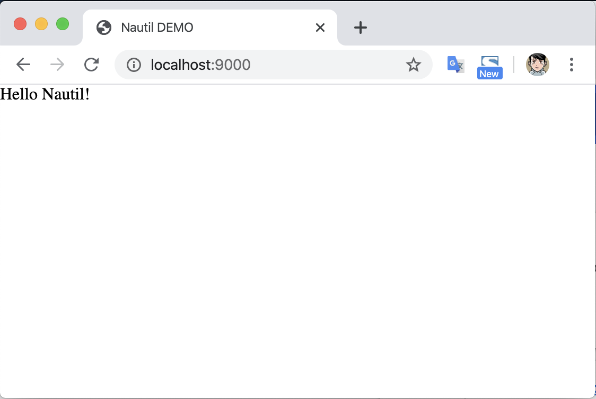
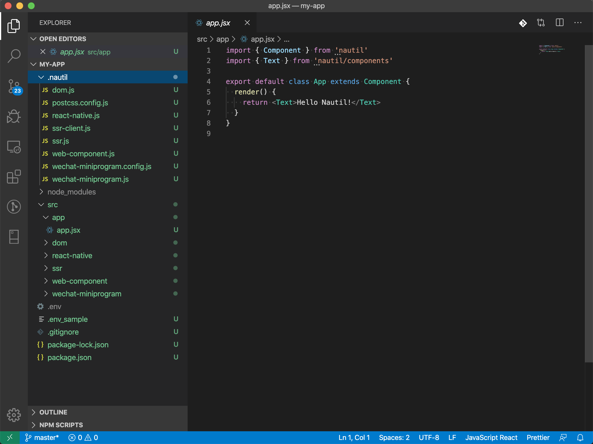

# First Nautil Application

Now let's create your first nautil application. It is very easy:

```
mkdir my-app && cd my-app
npx nautil-cli init
npm run dev
```


After your run `npm run dev`, you can open your browser the preview the current application.



Now your application has been created. The next thing is coding in your code editor.



All source code are in `src` directory, and there is a `.nautil` directory which contains cli runtime scripts.

Change the `app.jsx` in `app` directory to edit your own application.

Go on!
